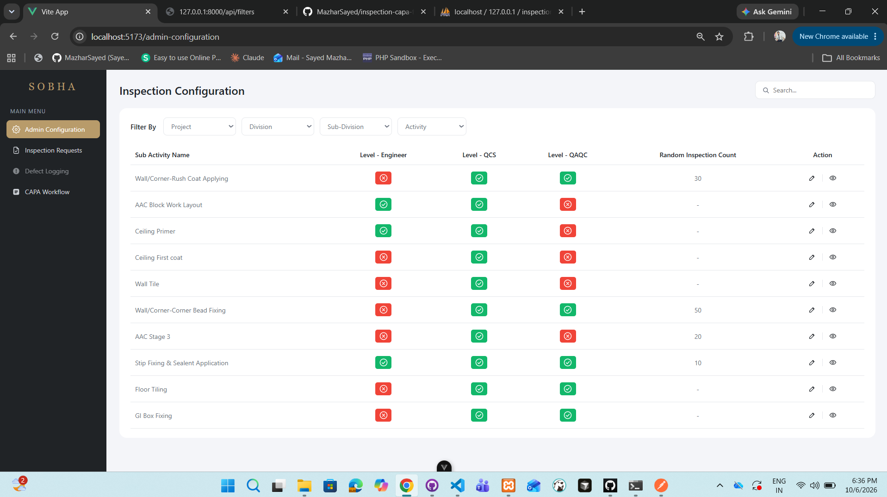

# Inspection CAPA Frontend

Vue 3 frontend for the inspection configuration, CAPA requests and inspection approval screens.

Backend (Laravel API): https://github.com/MazharSayed/inspection-capa-backend

## Screens

- **Inspection Configuration**: filters, search, approval level indicators, and edit and view actions
- **CAPA Requests List**: 7 filters, search and status badges. The view action opens a work in progress page
- **Inspection Requests List**: filters, search and approval progress dots
- **Inspection Request Detail**: request details, documents and the approval timeline

Filters cascade from Project down to Sub-Activity. Each filter unlocks after its parent is chosen and lists only related options. Changing a parent resets the filters below it.

## Stack

Vue 3 (Composition API), Vite, Vue Router, Pinia, Axios, plain CSS

## Setup

Start the backend first (see its README), then:

```bash
npm install
cp .env.example .env
npm run dev
```

Open http://localhost:5173. The API URL is set in `.env`:

```
VITE_API_BASE_URL=http://127.0.0.1:8000/api
```

Restart `npm run dev` after changing it.

## Project structure

```
src/
  api/          one file per API area, all built on a shared axios instance
  components/   sidebar, filter select, status badge, approval timeline and other shared UI
  composables/  useCascadingFilters and useFilteredList, shared by the list screens
  stores/       Pinia store holding the filter dropdown options
  utils/        date formatting
  views/        one view per screen
```

## Screenshots

### Inspection Configuration


### CAPA Requests List
![CAPA Requests
